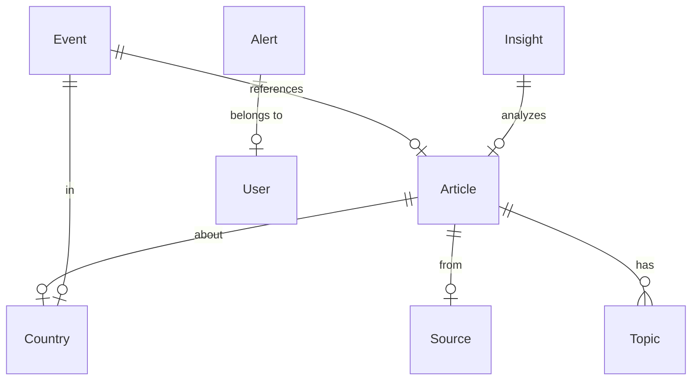

# مِرصاد (Mirsad) - Arab Monitor
## Technical Architecture Document

---

## 1. Product Brief

### 1.1 Overview
**مِرصاد** هي منصة عربية متكاملة للرصد والتحليل اللحظي، تجمع الأخبار من مصادر متعددة وتقدم تحليلات ذكية بالذكاء الاصطناعي مع عرض جغرافي تفاعلي.

### 1.2 Target Audience
- باحثون ومحللو سياسات
- غرف الأخبار وفرق الرصد الإعلامي
- جهات حكومية ومراكز دراسات
- متابعون للأسواق والطاقة والجيوسياسة
- فرق OSINT العربية

### 1.3 Key Features
- تجميع الأخبار من مصادر متعددة (RSS, APIs)
- خريطة تفاعلية للأحداث
- تلخيص وتحليل ذكي بالعربية
- تصنيف حسب الدولة/القطاع/الموضوع
- تنبيهات مخصصة
- تقارير قابلة للتصدير

---

## 2. Technical Architecture

### 2.1 System Architecture

```
┌─────────────────────────────────────────────────────────────────┐
│                        FRONTEND LAYER                           │
│  ┌─────────────┐  ┌─────────────┐  ┌─────────────┐            │
│  │  Dashboard  │  │    Map      │  │   News      │            │
│  └─────────────┘  └─────────────┘  └─────────────┘            │
│  ┌─────────────┐  ┌─────────────┐  ┌─────────────┐            │
│  │  Countries  │  │  Analytics  │  │   Alerts    │            │
│  └─────────────┘  └─────────────┘  └─────────────┘            │
│                    Next.js 16 + React 19                       │
└─────────────────────────────────────────────────────────────────┘
                              │
                              ▼
┌─────────────────────────────────────────────────────────────────┐
│                         API LAYER                               │
│  ┌─────────────┐  ┌─────────────┐  ┌─────────────┐            │
│  │  /api/news  │  │ /api/ai     │  │/api/alerts  │            │
│  └─────────────┘  └─────────────┘  └─────────────┘            │
│  ┌─────────────┐  ┌─────────────┐  ┌─────────────┐            │
│  │/api/countries│ │/api/sources │  │/api/reports │            │
│  └─────────────┘  └─────────────┘  └─────────────┘            │
│                    Next.js API Routes                           │
└─────────────────────────────────────────────────────────────────┘
                              │
        ┌─────────────────────┼─────────────────────┐
        ▼                     ▼                     ▼
┌───────────────┐   ┌───────────────┐   ┌───────────────┐
│  DATA LAYER   │   │   AI LAYER    │   │ EXTERNAL API  │
│   Prisma +    │   │  z-ai-sdk     │   │  RSS Feeds    │
│   SQLite      │   │  (LLM/TTS)    │   │  News APIs    │
└───────────────┘   └───────────────┘   └───────────────┘
```

### 2.2 Technology Stack

| Layer | Technology | Purpose |
|-------|------------|---------|
| Frontend | Next.js 16 + React 19 | SSR, App Router |
| Styling | Tailwind CSS 4 + shadcn/ui | RTL Support |
| State | Zustand + TanStack Query | Client & Server State |
| Database | Prisma + SQLite | Data Persistence |
| Charts | Recharts | Data Visualization |
| Maps | MapLibre GL | Interactive Maps |
| AI | z-ai-web-dev-sdk | LLM, TTS, VLM |
| i18n | next-intl | Arabic RTL Support |

### 2.3 Directory Structure

```
src/
├── app/                    # Next.js App Router
│   ├── [locale]/          # Locale-based routing
│   │   ├── page.tsx       # Dashboard
│   │   ├── map/           # Interactive Map
│   │   ├── news/          # News Feed
│   │   ├── countries/     # Countries Overview
│   │   ├── country/[id]/  # Country Details
│   │   ├── analytics/     # AI Analytics
│   │   ├── alerts/        # Alerts & Signals
│   │   ├── settings/      # User Settings
│   │   └── about/         # About Page
│   └── api/               # API Routes
│       ├── news/          # News Endpoints
│       ├── ai/            # AI Endpoints
│       ├── countries/     # Countries Data
│       └── alerts/        # Alerts Management
├── components/
│   ├── ui/                # shadcn/ui Components
│   ├── layout/            # Layout Components
│   ├── dashboard/         # Dashboard Widgets
│   ├── map/               # Map Components
│   ├── news/              # News Components
│   └── shared/            # Shared Components
├── lib/
│   ├── db.ts              # Database Client
│   ├── ai/                # AI Integration
│   ├── sources/           # Data Sources
│   └── utils.ts           # Utilities
├── hooks/                 # Custom Hooks
├── types/                 # TypeScript Types
├── config/                # App Configuration
└── i18n/                  # Translations
    ├── ar.json            # Arabic
    └── en.json            # English
```

### 2.4 Database Schema



### 2.5 Multi-Variant Architecture

```typescript
interface BrandConfig {
  name: string;
  nameAr: string;
  tagline: string;
  taglineAr: string;
  theme: {
    primary: string;
    accent: string;
  };
  features: {
    map: boolean;
    ai: boolean;
    alerts: boolean;
  };
  feeds: string[];
  sectors: string[];
}

const VARIANTS: Record<string, BrandConfig> = {
  default: { /* Arab Monitor */ },
  economy: { /* Arab Economy Monitor */ },
  tech: { /* Arab Tech Monitor */ },
  energy: { /* Arab Energy Monitor */ },
};
```

---

## 3. Data Flow

### 3.1 News Collection Pipeline

```
RSS/API Sources → Normalizer → Deduplication → Classification → Storage → AI Analysis
```

### 3.2 AI Processing Pipeline

```
Article Text → Preprocessing → LLM Analysis → Structured Output
                                           ↓
                                    - Summary (Arabic)
                                    - Entities
                                    - Sentiment
                                    - Category
                                    - Risk Level
```

---

## 4. Security Considerations

- Input sanitization on all API endpoints
- Rate limiting on AI endpoints
- Environment-based secrets
- No client-side secrets exposure
- Secure default configurations

---

## 5. Performance Strategy

- Code splitting per page
- Lazy loading for maps and charts
- Skeleton loaders for async content
- Request caching with TanStack Query
- Optimized Arabic font loading
- Virtualized lists for long content

---

*Document Version: 1.0.0*
*Last Updated: 2024*
