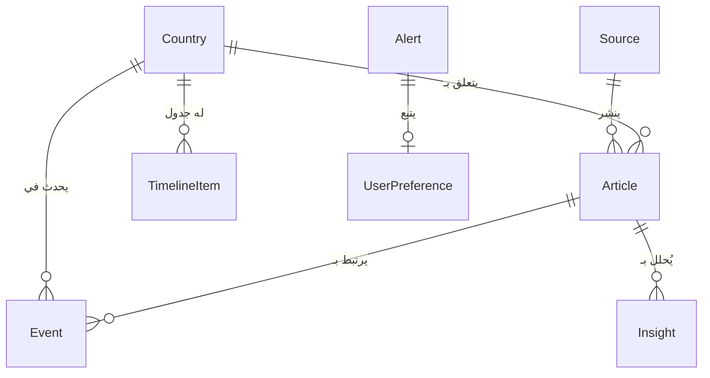

# 🏗️ المعمارية التقنية

## 📋 نظرة عامة

**مِرصاد** هي منصة ويب حديثة مبنية باستخدام أحدث التقنيات، مصممة لتكون قابلة للتوسع والصيانة بسهولة.

---

## 🎯 المبادئ التصميمية

| المبدأ | الوصف |
|--------|-------|
| **الوحدات** | فصل المسؤوليات بين المكونات |
| **القابلية للتوسع** | دعم إضافة ميزات جديدة بسهولة |
| **الأداء** | تحميل سريع وتجربة مستخدم سلسة |
| **الأمان** | حماية البيانات والمستخدمين |
| **الصيانة** | كود نظيف وقابل للقراءة |

---

## 📊 البنية العامة

```
┌─────────────────────────────────────────────────────────────────┐
│                        🎨 طبقة العرض                             │
│  ┌─────────────┐  ┌─────────────┐  ┌─────────────┐            │
│  │  Dashboard  │  │    Map      │  │   News      │            │
│  └─────────────┘  └─────────────┘  └─────────────┘            │
│  ┌─────────────┐  ┌─────────────┐  ┌─────────────┐            │
│  │  Countries  │  │  Analytics  │  │   Alerts    │            │
│  └─────────────┘  └─────────────┘  └─────────────┘            │
│                    Next.js 16 + React 19                       │
│                    Tailwind CSS + shadcn/ui                     │
└─────────────────────────────────────────────────────────────────┘
                              │
                              ▼
┌─────────────────────────────────────────────────────────────────┐
│                        🔄 طبقة الـ API                           │
│  ┌─────────────┐  ┌─────────────┐  ┌─────────────┐            │
│  │  /api/news  │  │  /api/ai    │  │/api/alerts  │            │
│  └─────────────┘  └─────────────┘  └─────────────┘            │
│  ┌─────────────┐  ┌─────────────┐  ┌─────────────┐            │
│  │/api/countries│ │/api/sources │  │ /api/stats  │            │
│  └─────────────┘  └─────────────┘  └─────────────┘            │
│                    Next.js API Routes                           │
│                    RESTful Endpoints                            │
└─────────────────────────────────────────────────────────────────┘
                              │
        ┌─────────────────────┼─────────────────────┐
        ▼                     ▼                     ▼
┌───────────────┐   ┌───────────────┐   ┌───────────────┐
│  🗄️ طبقة البيانات │   │  🤖 طبقة الذكاء │   │  🌐 مصادر خارجية │
│   Prisma ORM   │   │  z-ai-sdk     │   │  RSS Feeds    │
│   SQLite       │   │  LLM / TTS    │   │  News APIs    │
└───────────────┘   └───────────────┘   └───────────────┘
```

---

## 🏛️ المكونات الرئيسية

### 1️⃣ طبقة العرض (Frontend)

#### Next.js App Router
- **Server-Side Rendering** للصفحات الرئيسية
- **Static Generation** للصفحات الثابتة
- **Incremental Static Regeneration** للتحديثات

#### React 19
- **Server Components** للأداء الأمثل
- **Client Components** للتفاعلية
- **Suspense** للتحميل البطيء

#### Tailwind CSS + shadcn/ui
- **RTL Support** مدمج
- **Dark Mode** تلقائي
- **Responsive Design** للموبايل

### 2️⃣ طبقة الـ API

#### Next.js API Routes
```typescript
// مثال: /api/news/route.ts
export async function GET(request: Request) {
  const { searchParams } = new URL(request.url);
  const country = searchParams.get('country');
  
  const news = await db.article.findMany({
    where: country ? { countryId: country } : undefined,
    orderBy: { publishedAt: 'desc' },
    take: 20,
  });
  
  return Response.json(news);
}
```

### 3️⃣ طبقة البيانات

#### Prisma ORM
```typescript
// عميل قاعدة البيانات
import { PrismaClient } from '@prisma/client';
const db = new PrismaClient();

// استعلامات مُنسّقة
const articles = await db.article.findMany({
  include: { source: true, country: true },
  where: { publishedAt: { gte: yesterday } },
});
```

#### SQLite
- قاعدة بيانات مدمجة
- لا تحتاج خادم منفصل
- مثالية للتطوير والنشر الصغير

---

## 📁 هيكل المجلدات التفصيلي

```
src/
├── app/                          # Next.js App Router
│   ├── [locale]/                 # التوجيه حسب اللغة
│   │   ├── layout.tsx            # تخطيط الصفحات
│   │   ├── page.tsx              # لوحة التحكم
│   │   ├── map/
│   │   │   └── page.tsx          # الخريطة التفاعلية
│   │   ├── news/
│   │   │   └── page.tsx          # تدفق الأخبار
│   │   ├── countries/
│   │   │   ├── page.tsx          # قائمة الدول
│   │   │   └── [code]/
│   │   │       └── page.tsx      # صفحة الدولة
│   │   ├── analytics/
│   │   │   └── page.tsx          # التحليلات الذكية
│   │   ├── alerts/
│   │   │   └── page.tsx          # التنبيهات
│   │   ├── signals/
│   │   │   └── page.tsx          # الإشارات
│   │   ├── settings/
│   │   │   └── page.tsx          # الإعدادات
│   │   └── about/
│   │       └── page.tsx          # عن المنصة
│   ├── api/                      # نقاط النهاية
│   │   ├── news/
│   │   │   └── route.ts          # أخبار
│   │   ├── ai/
│   │   │   └── route.ts          # ذكاء اصطناعي
│   │   ├── countries/
│   │   │   ├── route.ts          # قائمة الدول
│   │   │   └── [code]/
│   │   │       └── route.ts      # تفاصيل الدولة
│   │   ├── alerts/
│   │   │   └── route.ts          # التنبيهات
│   │   ├── events/
│   │   │   └── route.ts          # الأحداث
│   │   └── stats/
│   │       └── route.ts          # الإحصائيات
│   ├── layout.tsx                # التخطيط الرئيسي
│   ├── page.tsx                  # الصفحة الرئيسية
│   └── globals.css               # الأنماط العامة
│
├── components/
│   ├── ui/                       # مكونات shadcn/ui
│   │   ├── button.tsx
│   │   ├── card.tsx
│   │   ├── dialog.tsx
│   │   └── ...
│   ├── layout/
│   │   ├── header.tsx            # رأس الصفحة
│   │   ├── sidebar.tsx           # الشريط الجانبي
│   │   └── app-layout.tsx        # التخطيط الرئيسي
│   ├── dashboard/                # عناصر لوحة التحكم
│   ├── map/                      # عناصر الخريطة
│   └── shared/                   # عناصر مشتركة
│
├── lib/
│   ├── db.ts                     # عميل قاعدة البيانات
│   ├── utils.ts                  # الأدوات المساعدة
│   └── ai/                       # تكامل الذكاء الاصطناعي
│
├── hooks/
│   ├── use-mobile.ts             # اكتشاف الموبايل
│   └── use-toast.ts              # إشعارات Toast
│
├── types/
│   └── index.ts                  # أنواع TypeScript
│
├── config/
│   └── branding.ts               # تكوين العلامة التجارية
│
├── i18n/
│   ├── config.ts                 # إعدادات الترجمة
│   ├── routing.ts                # توجيه اللغات
│   ├── request.ts                # معالجة الطلبات
│   ├── ar.json                   # العربية
│   └── en.json                   # الإنجليزية
│
└── app/globals.css               # أنماط Tailwind
```

---

## 🗄️ نموذج قاعدة البيانات

### مخطط العلاقات



### النماذج الرئيسية

#### 📰 Article (المقال)
```prisma
model Article {
  id            String   @id @default(cuid())
  title         String
  content       String?
  summary       String?
  summaryAi     String?
  url           String   @unique
  imageUrl      String?
  publishedAt   DateTime?
  category      ArticleCategory?
  sentiment     SentimentType?
  riskLevel     RiskLevel?
  entities      Json?
  topics        Json?
  sourceId      String?
  source        Source?  @relation(...)
  countryId     String?
  country       Country? @relation(...)
  events        Event[]
  insights      Insight[]
  aiProcessed   Boolean  @default(false)
  createdAt     DateTime @default(now())
  updatedAt     DateTime @updatedAt
}
```

#### 🌍 Country (الدولة)
```prisma
model Country {
  id              String   @id @default(cuid())
  code            String   @unique
  name            String
  nameAr          String
  region          String?
  regionAr        String?
  coordinates     Json?
  flag            String?
  riskIndex       Float?
  stabilityIndex  Float?
  articles        Article[]
  events          Event[]
  timeline        TimelineItem[]
  articleCount    Int      @default(0)
  eventCount      Int      @default(0)
  createdAt       DateTime @default(now())
  updatedAt       DateTime @updatedAt
}
```

#### 🔔 Alert (التنبيه)
```prisma
model Alert {
  id            String   @id @default(cuid())
  name          String
  keywords      Json?
  countries     Json?
  categories    Json?
  riskLevels    Json?
  isActive      Boolean  @default(true)
  frequency     AlertFrequency @default(IMMEDIATE)
  channels      Json?
  triggerCount  Int      @default(0)
  lastTriggered DateTime?
  createdAt     DateTime @default(now())
  updatedAt     DateTime @updatedAt
}
```

---

## 🔄 النسخ المتعددة (Multi-Variant)

### المفهوم
نظام النسخ المتعددة يسمح بإنشاء نسخ مختلفة من المنصة بنفس الكود الأساسي، مع تخصيص:
- الهوية البصرية (الاسم، الألوان، الشعار)
- القطاعات الافتراضية
- الدول المتابعة
- الميزات المفعّلة

### التكوين
```typescript
interface BrandConfig {
  id: string;
  name: string;
  nameAr: string;
  tagline: string;
  taglineAr: string;
  theme: {
    primary: string;
    secondary: string;
    accent: string;
  };
  features: {
    map: boolean;
    ai: boolean;
    alerts: boolean;
    analytics: boolean;
    timeline: boolean;
    export: boolean;
  };
  defaultSectors: Sector[];
  defaultCountries: string[];
  defaultSources: string[];
}
```

### النسخ المتاحة

| النسخة | الاسم | التخصص |
|--------|-------|--------|
| `default` | مِرصاد | المنصة العامة |
| `economy` | مرصد الاقتصاد العربي | الاقتصاد والأسواق |
| `tech` | مرصد التقنية العربية | التقنية والشركات الناشئة |
| `energy` | مرصد الطاقة العربية | النفط والغاز والطاقة المتجددة |

---

## 🔐 الاعتبارات الأمنية

### 1️⃣ تنظيف المدخلات
```typescript
import { z } from 'zod';

const ArticleSchema = z.object({
  title: z.string().max(500),
  url: z.string().url(),
  content: z.string().optional(),
});
```

### 2️⃣ حماية API
- Rate Limiting على نقاط الذكاء الاصطناعي
- التحقق من المدخلات
- CORS محدود

### 3️⃣ البيانات الحساسة
- متغيرات البيئة للأسرار
- عدم كشف الأسرار للعميل
- اتصالات مشفرة

---

## 📈 استراتيجية الأداء

### 1️⃣ تقسيم الكود
- تحميل كسول للصفحات
- تقسيم حسب المسار
- تحميل المكونات عند الحاجة

### 2️⃣ التخزين المؤقت
- TanStack Query للبيانات
- Next.js Cache للصفحات
- تجميع الموارد الثابتة

### 3️⃣ التحسينات
- ضغط الصور تلقائياً (Sharp)
- تحميل الخطوط المحسّنة
- القوائم الافتراضية للمحتوى الطويل

---

## 🔧 إعدادات البناء

### next.config.ts
```typescript
const config = {
  output: 'standalone',
  images: {
    formats: ['image/avif', 'image/webp'],
  },
  experimental: {
    optimizePackageImports: ['lucide-react', 'recharts'],
  },
};
```

---

## 📊 المراقبة والتسجيل

### مستويات السجل
```typescript
enum LogLevel {
  INFO      // معلومات
  WARNING   // تحذيرات
  ERROR     // أخطاء
  CRITICAL  // حرجة
}
```

### نموذج السجل
```prisma
model SystemLog {
  id        String   @id @default(cuid())
  level     LogLevel
  message   String
  details   Json?
  source    String?
  createdAt DateTime @default(now())
}
```

---

## 🚀 الخطوات التالية

- [إضافة المصادقة](./deployment.md#المصادقة)
- [تكامل الذكاء الاصطناعي](./ai-layer.md)
- [النشر على الخادم](./deployment.md)

---

*آخر تحديث: 2024*
